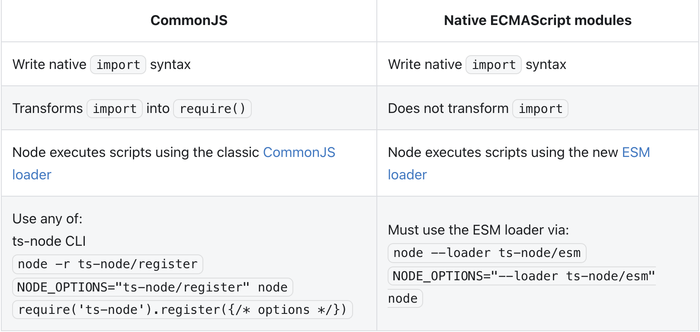

React,TypeScript,Nextjs の勉強も兼ねてブログサイトを作りました。  
これからは学んだことをちょくちょくここに投稿していきたい。  
Nextjs のチュートリアルがベースとなっており、そこから色々手を加えています。
記事投稿は GitHub の main ブランチに push して管理する形式です。  
Algolia による検索機能や記事のディレクトリ管理など、[この方のブログ](https://kenzoblog.vercel.app/)をめちゃめちゃ参考にさせていただいてます。  
ちなみに CSS Framework には Chakra UI を用いています。簡単にレスポンシブにできたりいい感じのレイアウトが用意されていたり雑に作るならめちゃめちゃ便利だと思う、、、

## 使用技術

- React
- TypeScript
- react-markdown
- react-syntax-highlighter
- Chakra UI
- Algolia

## 詰まったところ

以下実装で詰まったところ

- build 時に含まれないファイルを ts-node で実行する  
  [Algolia](https://www.algolia.com/)という検索機能サービスを用いて記事検索機能を実装しているのですが、その際検索対象を Algolia にレコード登録する必要があります。
  そこで記事を新規作成した際、現在 Algolia に登録されているレコードとディレクトリ内の記事を比較して差分を Algolia に新規登録する ts ファイルを作成しました。

  ```ts:algolia.ts
  import algoliasearch from 'algoliasearch';
  import { getSortedPostsData } from './posts';
  import { hits } from 'type';

  require('dotenv').config({ path: '.env.local' });

  const client = algoliasearch(process.env.NEXT_PUBLIC_ALGOLIA_APP_ID, process.env.ALGOLIA_ADMIN_KEY);
  const index = client.initIndex('blog_of_the_ryo');
  const allPostsData = getSortedPostsData();

  const main = () => {
    index
      .search('')
      .then(({ hits }: hits) => {
        const hitsId = hits.map((hit) => hit.id);

        if (allPostsData.length > hits.length) {
          const newPost = allPostsData.filter((post) => {
            return hitsId.indexOf(post.id) == -1;
          });

          newPost.map((post) => {
            post.objectID = post.id;
          });

          index
            .saveObjects(newPost)
            .then(({ objectIDs }) => {
              console.log(objectIDs);
              console.log('検索結果を追加しました');
            })
            .catch((err) => {
              console.log(err);
            });
        } else {
          console.log('新規投稿はありません');
        }
      })
      .catch((err) => {
        console.log(err);
      });
  };

  main();
  ```

  特に設定せず ts-node で実行すると以下のエラーが吐き出されてしまいます。

  ```
  SyntaxError: Cannot use import statement outside a module
  ```

  原因としては、tsconfig.json で

  ```
  "module": "esnext"
  ```

  と設定されていたからでした。  
  こちらの表は[ts-node 公式](https://typestrong.org/ts-node/docs/imports)に表記されている CommomJs と ECMAScript の比較です。
  記載されているように ts-node を実行する際は、"module": "commonjs"と設定する必要があります。

  

  また、Nextjs は build 時に環境変数を読み込んでくれますが、今回は build 時に実行されるわけではないので dotenv を用いて環境変数を読み込む必要があります。

  ```ts:algolia.ts
  require('dotenv').config({ path: '.env.local' });
  ```

## 所感

CommonJS と ECMAScript の違いだったり、Webpack の設定だったり Github Action だったり初めて知る、触る部分が多く、色々勉強になってよかった。  
TypeScript 楽しいのでまた似たような構成で何か作ってみようと思う。  
多分使っていくうちに直したいところ出てくると思うのでその都度改良していきたい。
