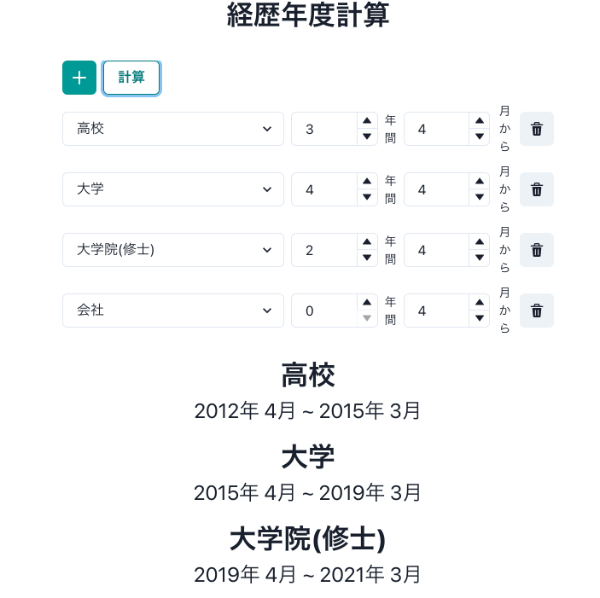

履歴書書くたびに毎回入学年度、卒業年度を忘れる(特に高校とか)ので計算するやつを作った。



これは僕の場合だが、年度は覚えてなくても何月に入学(入社)して、何年間通った(勤めた)かは覚えているのでそこから計算するようにした。

使い方としてはシンプルで、高校、大学など各経歴の勤め上げた年数(3 ヶ月の場合は 0,1 年半の場合は 1)と入学(入社)した月を入力し、計算ボタンを押すだけ。
すると現在日付から入力した経歴年度を遡って計算し、表示してくれる。

日付の計算には[Dayjs](https://day.js.org/en/)を使った。  
以下は一例だがこんな感じで簡単に日付計算ができる。

```ts
const now = dayjs();
const nowYear = now.year(); //2022
const yesterday = now.subtract(1, 'day');
const tomorrow = now.add(1, 'day');
```

配列 useState の扱い方で少しつまづいた。配列 useState を setState する場合、`push()`などは使わす、以下のようにスプレッド構文を用いて更新しなければならない。

```ts
const [hogeList, setHogeList] = useState<Type[]>([]);

const addHoge = () => {
  setHogeList([
    ...hogeList,
    {
      hoo: 'hoo',
      bar: 'bar',
    },
  ]);
};
```

あと個人的にはカスタムフックのちょっとした復習になってよかった。
