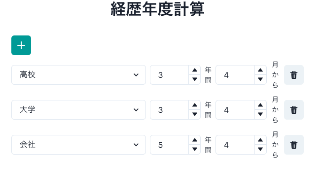
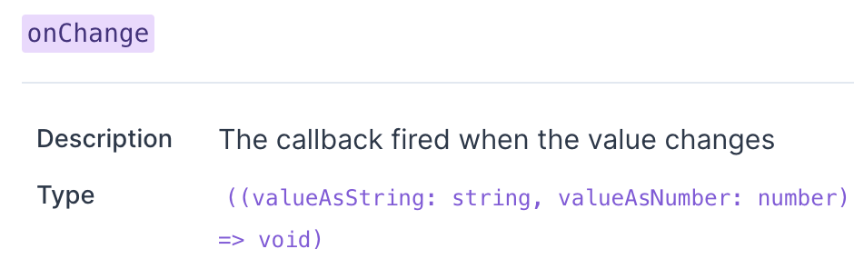

普段 React で何か書くときは CSS Framework には[Chakra UI](https://chakra-ui.com/)を使っています。  
簡単にレスポンシブにできたり color theme が用意されていたりとても扱いやすく重宝しています。
現在以下のような経歴年度を計算してくれるアプリを作成しているのですが、そこで少し困ったことがあったので残します。



年度と月の入力欄に Chakra UI で用意されている[Number Input](https://chakra-ui.com/docs/form/number-input)を用いたのですが、この Number Input,他の Input コンポーネントと違い onChange 時 event を返さないのです。  
どういうことかと言いますと、例えば上の身分選択で用いられている[Select](https://chakra-ui.com/docs/form/select)や[Input](https://chakra-ui.com/docs/form/input)は onChange 時 event を引数に渡します。  
つまり配列の useState で入力欄の値を管理したい時、以下のように event.currentTarget から id を取得して onChange 時に state を更新できます。

```tsx
const [careerList, setCareerList] = useState<carrerType[]>([
  { id: '1', job: '', year: 3, month: 4 },
]);

const handleChangeJob = (e: React.ChangeEvent<HTMLSelectElement>) => {
  const id = e.target.getAttribute('id');
  const value = e.target.value;
  setCareerList(
    careerList.map((career) => {
      if (career.id === id) {
        career.job = value;
      }
      return career;
    }),
  );
};

<Select value={job} onChange={handleChangeJob} id={id}>
  <option value='高校'>高校</option>
  <option value='大学'>大学</option>
  <option value='高専'>高専</option>
  <option value='会社'>会社</option>
  <option value='その他'>その他</option>
</Select>;
```

しかし Number Input は NumberInputField の Wrapper コンポーネントであり、onChange 時は change 後の value のみを引数に渡します。



よって event から id を取得することができません。  
今回は activeElement を使って取得することにしました。

```tsx
const handleChangeYear = (str: string, num: number) => {
  // focusしてactiveElementを取得した後でid判定するためにsetTimeoutで囲っている
  setTimeout(() => {
    if (document.activeElement) {
      const id = document.activeElement.getAttribute('id');
      setCareerList(
        careerList.map((career) => {
          if (career.id === id && num > 0) {
            career.year = num;
          }
          return career;
        }),
      );
    }
  }, 0);
};

<NumberInput defaultValue={3} min={1} value={year} onChange={handleChangeYear} id={id}>
  <NumberInputField />
  <NumberInputStepper>
    <NumberIncrementStepper />
    <NumberDecrementStepper />
  </NumberInputStepper>
</NumberInput>;
```

これにより useState で管理している配列を更新することができました。  
ちなみに[event を返してくれという issue](https://github.com/chakra-ui/chakra-ui/issues/617)が立っていましたが、変更予定はなさそうです。

## 追記

この方法だと NumberInput から別の NumberInput に直接 focus を移動した時値が適切に変更されませんでした、、、  
onChange は onBlur 時も発動するので適切な activeElement が取得できないようです。  
いい方法あったら教えてください、、、(一旦 NumberInput やめて Input に変更して対処しました)
