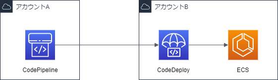

## やること

アカウント A に存在する CodePipeline からアカウント B に存在する CodeDeploy を実行し、ECS をデプロイする。



## 構築

CodeDeploy リソースの構築は省略します。

### アーティファクト用 S3 と KMS を作成

アカウント A に CodePipeline で用いる KMS と S3 を作成します。

CloudFormation で構築しています。

```yaml
ArtifactBucket:
  Type: AWS::S3::Bucket
  Properties:
    BucketName: 'artifact-bucket'
    VersioningConfiguration:
      Status: Enabled
    PublicAccessBlockConfiguration:
      BlockPublicAcls: true
      BlockPublicPolicy: true
      IgnorePublicAcls: true
      RestrictPublicBuckets: true
    BucketEncryption:
      ServerSideEncryptionConfiguration:
        - ServerSideEncryptionByDefault:
            SSEAlgorithm: AES256

ArtifactBucketPolicy:
  Type: AWS::S3::BucketPolicy
  Properties:
    Bucket: !Ref ArtifactBucket
    PolicyDocument:
      Statement:
        - Effect: Deny
          Action: 's3:*'
          Principal: '*'
          Resource:
            - !Sub '${ArtifactBucket.Arn}/*'
            - !GetAtt ArtifactBucket.Arn
          Condition:
            Bool:
              aws:SecureTransport: false
        - Effect: Deny
          Action: 's3:PutObject'
          Principal: '*'
          Resource: !Sub '${ArtifactBucket.Arn}/*'
          Condition:
            StringNotEquals:
              s3:x-amz-server-side-encryption: aws:kms
        - Effect: Allow
          Action:
            - 's3:Get*'
            - 's3:Put*'
          Principal:
            AWS: 'arn:aws:iam::<アカウントBのアカウントID>:root'
          Resource: !Sub '${ArtifactBucket.Arn}/*'
        - Effect: Allow
          Action: 's3:ListBucket'
          Principal:
            AWS: 'arn:aws:iam::<アカウントBのアカウントID>:root'
          Resource:
            - !Sub '${ArtifactBucket.Arn}/*'
            - !GetAtt ArtifactBucket.Arn

KMSKey:
  Type: AWS::KMS::Key
  Properties:
    Enabled: true
    Description: 'key for codepipeline'
    KeyUsage: ENCRYPT_DECRYPT
    KeyPolicy: !Sub |
      {
        "Version" : "2012-10-17",
        "Id" : "key-consolepolicy-3",
        "Statement" : [
          {
            "Sid" : "Enable IAM User Permissions",
            "Effect" : "Allow",
            "Principal" : {
              "AWS" : "arn:aws:iam::${AWS::AccountId}:root"
            },
            "Action" : "kms:*",
            "Resource" : "*"
          },
          {
            "Sid" : "Allow access for Key Administrators",
            "Effect" : "Allow",
            "Principal" : {
              "AWS" : "<管理者とするRoleまたはUserのArn>"
            },
            "Action" : [
              "kms:Create*",
              "kms:Describe*",
              "kms:Enable*",
              "kms:List*",
              "kms:Put*",
              "kms:Update*",
              "kms:Revoke*",
              "kms:Disable*",
              "kms:Get*",
              "kms:Delete*",
              "kms:TagResource",
              "kms:UntagResource",
              "kms:ScheduleKeyDeletion",
              "kms:CancelKeyDeletion"
            ],
            "Resource" : "*"
          },
          {
            "Sid" : "Allow use of the key",
            "Effect" : "Allow",
            "Principal" : {
              "AWS" : [
                "arn:aws:iam::<アカウントBのアカウントID>:root",
                "<CodePipelineのRoleArn>"
              ]
            },
            "Action" : [
              "kms:Encrypt",
              "kms:Decrypt",
              "kms:ReEncrypt*",
              "kms:GenerateDataKey*",
              "kms:DescribeKey"
            ],
            "Resource" : "*"
          },
          {
            "Sid" : "Allow attachment of persistent resources",
            "Effect" : "Allow",
            "Principal" : {
              "AWS" : [
                "arn:aws:iam::<アカウントBのアカウントID>:root",
                "<CodePipelineのRoleArn>"
              ]
            },
            "Action" : [
              "kms:CreateGrant",
              "kms:ListGrants",
              "kms:RevokeGrant"
            ],
            "Resource" : "*",
            "Condition" : {
              "Bool" : {
                "kms:GrantIsForAWSResource" : "true"
              }
            }
          }
        ]
      }
    KeySpec: SYMMETRIC_DEFAULT
```

### CodeDeploy のサービス Role を修正

CodeDeploy デプロイグループのサービス Role は以下になります。

※arn:aws:iam::aws:policy/AWSCodeDeployRoleForECS もアタッチしています。

```json:ポリシー
{
  "Version": "2012-10-17",
  "Statement": [
    {
      "Action": ["s3:GetObject*", "s3:PutObject", "s3:PutObjectAcl"],
      "Resource": "<アーティファクト用S3のArn>/*",
      "Effect": "Allow"
    },
    {
      "Action": [
        "kms:DescribeKey",
        "kms:GenerateDataKey*",
        "kms:Encrypt",
        "kms:ReEncrypt*",
        "kms:Decrypt"
      ],
      "Resource": "<KMSのArn>",
      "Effect": "Allow"
    },
    {
      "Action": [
        "codedeploy:CreateDeployment",
        "codedeploy:GetDeployment",
        "codedeploy:GetApplication",
        "codedeploy:GetApplicationRevision",
        "codedeploy:RegisterApplicationRevision",
        "codedeploy:GetDeploymentConfig",
        "ecs:RegisterTaskDefinition",
        "ecs:TagResource"
      ],
      "Resource": "*",
      "Effect": "Allow"
    }
  ]
}
```

```json:信頼ポリシー
{
  "Version": "2012-10-17",
  "Statement": [
    {
      "Effect": "Allow",
      "Principal": {
        "Service": "codedeploy.amazonaws.com",
        "AWS": "<CodePipelineのRoleArn>"
      },
      "Action": "sts:AssumeRole"
    }
  ]
}
```

### CodePipeline のサービス Role を作成

ビルド等に関する権限は省略しています。

```json
{
  "Version": "2012-10-17",
  "Statement": [
    {
      "Action": ["s3:Get*", "s3:PutObject"],
      "Resource": ["<アーティファクト用S3バケットのArn>", "<アーティファクト用S3バケットのArn>/*"],
      "Effect": "Allow"
    },
    {
      "Action": "sts:AssumeRole",
      "Resource": "<CodeDeployのRoleArn>",
      "Effect": "Allow"
    }
  ]
}
```

### CodePipeline を作成

CodePipeline にてクロスアカウントリソースを指定する場合、AWS CLI あるいは SDK で作成/修正する必要があります。(※マネジメントコンソールからは指定できません。)  
下記は CodePipeline の設定ファイルです。ソースステージやビルドステージ等は省略していますが、クロスアカウントに関わる部分だけ抜粋しています。

```json:pipeline.json
{
  "pipeline": {
    "name": "cross-pipeline",
    "roleArn": "<CodePipelineのRoleArn>",
    "artifactStore": {
      "type": "S3",
      "location": "<アーティファクト用S3バケットのバケット名>",
      "encryptionKey": {
        "id": "<KMSのArn>",
        "type": "KMS"
      }
    },
    "stages": [
      // ~~省略~~
      {
        "name": "Deploy",
        "actions": [
          {
            "name": "Deploy",
            "actionTypeId": {
              "category": "Deploy",
              "owner": "AWS",
              "provider": "CodeDeployToECS",
              "version": "1"
            },
            "runOrder": 1,
            "configuration": {
              "AppSpecTemplateArtifact": "BuildArtifact",
              "AppSpecTemplatePath": "appspec.yaml",
              "ApplicationName": "<CodeDeployApplication名>",
              "DeploymentGroupName": "<CodeDeployデプロイグループ名>",
              "Image1ArtifactName": "BuildArtifact",
              "Image1ContainerName": "IMAGE_NAME",
              "TaskDefinitionTemplateArtifact": "BuildArtifact",
              "TaskDefinitionTemplatePath": "taskdef.json"
            },
            "outputArtifacts": [],
            "inputArtifacts": [
              {
                "name": "BuildArtifact"
              }
            ],
            "roleArn": "<CodeDeployのRoleArn>",
            "region": "ap-northeast-1",
            "namespace": "DeployVariables"
          }
        ]
      }
    ]
  }
}
```

この設定ファイルを用いて、下記コマンドにて CodePipeline を作成します。

```
aws codepipeline create-pipeline --cli-input-json file://pipeline.json
```

## 参考記事

https://docs.aws.amazon.com/ja_jp/codepipeline/latest/userguide/pipelines-create-cross-account.html
