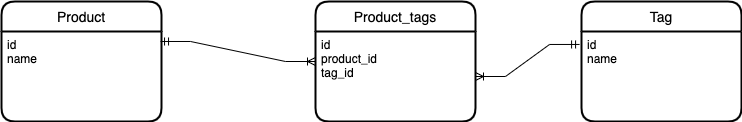

DynamoDB で多対多モデルの設計をするとき困ったので特性、ベストプラクティスについてまとめた。

## DynamoDB とは

AWS が提供する key-value 型の NoSQL データベースサービス。フルマネージドサービスであり、オートスケールやマルチリージョンでのレプリケーションなどに対応している。

## NoSQL とは

Not Only SQL の略で、特定の技術というよりは RDB とは異なるデータベースモデルの総称(と認識している。違うかも)  
スキーマレスであり、RDB より柔軟なデータ構造を管理できる。
水平スケーラビリティに優れており、大量のデータやアクセス要求に対応しやすい。
トランザクションのサポートは RDB に比べて弱い。

## DynamoDB のインデックスについて

### インデックスとは

DB からデータを効率的に読み取るためのデータ構造。key-value 型においてはデータのキーとその値の場所を示すポインタで構成されている(と認識しているが、不正確な気がする)  
基本的に追加するほど書き込みの速度が低下する。

### プライマリキー

DB 内のデータを一意に識別するためのキー。基本的にはプライマリキーを用いてデータを取得することになる。以下の 2 種類の構成パターンがある。

1. パーティションキーのみのパターン  
   一つの属性(パーティションキー)で構成される

2. パーティションキーとソートキーのパターン  
   パーティションキーとソートキーの２つの属性で構成される。この 2 つの属性で項目(レコード)の一意性を示す必要がある。

### セカンダリインデックス

プライマリキー以外の属性の条件でデータを取得したいとき、そのままだと全データを取得(Scan)した後、取得した側でデータをフィルタリングする必要がある。
より効率的に条件に沿ったデータを取得するために、DynamoDB はインデックスを追加することができる。このインデックスをセカンダリインデックスという。

#### グローバルセカンダリインデックス(GSI)

インデックスのプライマリキーは、テーブルからの任意の 2 つの属性(パーティションキー、ソートキー)となる。  
この時、インデックスのプライマリキーは項目の一意性を示す必要はない。

#### ローカルセカンダリインデックス(LSI)

パーティションキーはテーブルのパーティションキーと一致する必要がある。ただし、ソートキーは任意の属性を選べる。
GSI と同じく、インデックスのプライマリキーは項目の一意性を示す必要はない。

## 多対多モデルについて

ここからが本題。
RDB において多対多を表現する際は、中間テーブルを作成することが一般的な方法である。



この時、指定したタグを持つ製品を一覧で取得するとき、SQL は以下のように`JOIN`を使って取り出せる。

```sql
SELECT p.id, p.name
FROM product p
JOIN product_tag pt ON p.id = pt.product_id
JOIN tag t ON pt.tag_id = t.id
WHERE t.name = 'tag1';
```

DynamoDB で同じように中間テーブルを持つとどうなるだろうか。
DynamoDB は JOIN に相当する機能を持たないので、以下のように取得することになる。

```js
const { DynamoDBClient, QueryCommand, BatchGetItemCommand } = require('@aws-sdk/client-dynamodb');

const dynamoDB = new DynamoDBClient({ region: 'ap-northeast-1' });

const getProductsByTagId = async (tagId) => {
  try {
    // Product_Tagテーブルから指定されたtag_idに一致するアイテムをクエリ
    const queryResult = await dynamoDB.send(
      new QueryCommand({
        TableName: 'Product_Tag',
        IndexName: 'tag_id-index', // GSIの名前を指定
        KeyConditionExpression: '#tag_id = :tag_id',
        ExpressionAttributeNames: {
          '#tag_id': 'tag_id',
        },
        ExpressionAttributeValues: {
          ':tag_id': { S: tagId },
        },
      }),
    );

    // クエリ結果からproduct_idのリストを作成
    const productIds = queryResult.Items.map((item) => item.product_id);

    // Productテーブルからproduct_idのリストに一致するアイテムを取得
    const batchGetResult = await dynamoDB.send(
      new BatchGetItemCommand({
        RequestItems: {
          Product: {
            Keys: productIds.map((productId) => ({ id: { S: productId.S } })),
          },
        },
      }),
    );

    // 取得したProductアイテムを表示
    console.log('Products with tag_id:', tagId);
    console.log(batchGetResult.Responses.Product);
  } catch (err) {
    console.error('Error:', err);
  }
};

getProductsByTagId('tag1');
```

このように複数回に分けてデータをクエリする必要があり、RDB の場合に比べて明らかに無駄が発生している。
より複雑なデータになるとさらにパフォーマンスコストが嵩んでいくのが分かる。

## 隣接関係のリスト設計パターン

DynamoDB で多対多のモデルを扱う場合は、隣接関係のリストというパターンを用いることが AWS により推奨されている。
このパターンに従った時、テーブルの構成は以下のようになる。

| id(PK)   | relate_id(SK) | その他属性        |
| -------- | ------------- | ----------------- |
| product1 | product1      | product の属性... |
| tag1     | tag1          | tag の属性...     |
| product1 | tag1          | 中間項目の属性... |

製品もタグも同じテーブルで管理する。この時、各項目は以下のように分別される。

- id = relate_id=製品 id の時
  - 製品のレコード
- id = relate_id = タグ id の時
  - タグのレコード
- id = 製品 id かつ relate_id=タグ id の時
  - 製品とタグの関係を示すレコード

この時、指定したタグを持つ製品を一覧で取得しようとすると、以下のようになる。

```js
const { DynamoDBClient, QueryCommand } = require('@aws-sdk/client-dynamodb');

const dynamoDB = new DynamoDBClient({ region: 'ap-northeast-1' });

// 指定されたtag_idを持つProduct一覧を取得する関数
const getProductsByTagId = async (tagId) => {
  try {
    // ProductTagテーブルから指定されたtag_idに一致するrelate_idを持つアイテムをクエリ
    const queryResult = await dynamoDB.send(
      new QueryCommand({
        TableName: 'ProductTag',
        IndexName: 'relate_id-index', // GSIの名前を指定
        KeyConditionExpression: '#relate_id = :relate_id',
        FilterExpression: 'id <> :exclude_id',
        ExpressionAttributeNames: {
          '#relate_id': 'relate_id',
        },
        ExpressionAttributeValues: {
          ':relate_id': { S: tagId },
          ':exclude_id': { S: tagId },
        },
      }),
    );

    const products = queryResult.Items;

    // 取得したProductアイテムを表示
    console.log('Products with tag_id:', tagId);
    console.log(products);
  } catch (err) {
    console.error('Error:', err);
  }
};

// 指定のtag_idを持つProduct一覧を取得
getProductsByTagId('tag1');
```

クエリ一発で取得できているのが分かる。このように DynamoDB は、関連するデータは同一テーブルで管理することが推奨されている。  
RDB とはかなり異なる手法で設計する必要があるので最初は違和感があるがこのプラクティスに従って設計するとたしかに効率よく項目をクエリすることができる。

## 参考記事

- https://docs.aws.amazon.com/ja_jp/amazondynamodb/latest/developerguide/bp-adjacency-graphs.html
