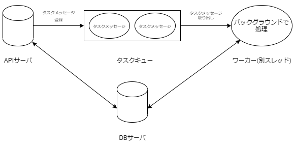

# タスクキューとは

- 一時的にタスクメッセージを保持する
- 保持しているタスクメッセージを先入れ先出し(FIFO)で順に取り出し、タスクをバックグラウンドで処理していく

## 今回の大まかな構成



# 主なタスクキューライブラリ

## [Celery](https://docs.celeryq.dev/en/stable/)

- メジャーなようで、用意されている機能も多い
- メッセージブローカ(メッセージを格納)、データストア(処理結果等を格納)として様々な DB を選択することができる(Redis, RabbitMQ, PostgreSQL 等)
- ドキュメントが手厚い印象
- Windows は Version4 からサポートしていない

## [RQ](https://python-rq.org/)

- Celery よりもシンプルなライブラリ
- Redis をメッセージブローカー、データストアとして用いる
- Windows 上ではワーカーが起動しない(ので今回はお見送り)

# 実装

今回は仕様の都合上タスク実行中でもキャンセルできる必要があったのですが、この機能が用意されているライブラリが Celery ぐらいしか見当たりませんでした
しかし、Celery でも実行中のタスクはキャンセルすることができず(原因不明)、threading, queue, multiprocessing を用いて簡易的に実装しました
API サーバ自体は Flask で実装しています

ParentThread は常にキューを監視しており、キューにタスクが入るとそれに応じてプロセスを作成し、逐次実行していきます。
また、タスクの状態は DB で保持しています(省略していますが SQLAlchemy を使用しています)

```py:worker.py
import threading
import queue
import time
import datetime
import multiprocessing
from enum import Enum

q = queue.Queue()

class ParentThread(threading.Thread):
    def __init__(self):
        super(ParentThread, self).__init__()

    def run(self):
        while True:
            item = q.get()

            try:
                from util.db_config import Task
                task = Task.query.filter_by(id=item.id).first()
                if task.status == Status.PENDING:
                    task.status = Status.STARTED.value
                    db.session.add(task)
                    db.session.commit()
                    childP = childProcess(name=item.name)
                    childP.start()
                    childP.join()

                    if task.status == Status.STARTED.value:
                        task.status = Status.COMPLETED.value
                        db.session.add(task)
                        db.session.commit()

            finally:
                q.task_done()

class childProcess(multiprocessing.Process):
    def __init__(self,name):
        super(childProcess, self).__init__()
        self.name = name

    # 処理内容
    def run(self):
        try:
            print(f'{self.name}が開始しました')
            for i in range(30):
                print(f'{datetime.datetime.now():%H:%M:%S}')
                time.sleep(1)

        finally:
            print(f'{self.name}が終了しました')

class Status(Enum):
    PENDING = "pending"
    STARTED = "started"
    FINISHED = "finished"
    CANCELED = "canceled"
```

ParentThread は Flask サーバ起動時に同時に立ち上げておきます

```py:main.py
from controllers.controller import app
from workers.worker import ParentThread

if __name__ == "__main__":
    t = ParentThread()
    t.start()
    app.run()
```

タスクリクエスト時は queue に item を入れます
キャンセル時はステータスを変更し、
実行中にキャンセルしたい場合は実行プロセス自体を終了させます

```py:controller.py
from flask import Flask,make_response
from workers.worker import q, Status
import random
import multiprocessing

app = Flask(__name__)

@app.route("/start")
def start():
    from util.db_config.py import Task, db
    item = QueueItem()
    q.put(item)

    taskForDB = Task(id = taskId, status = Status.PENDING.value)
    db.session.add(taskForDB)
    db.session.commit()
    return make_response(f'{item.name}の処理を受け付けました\n'), 202

@app.route("/cancel/<taskId>")
def cancel(taskId):
    from util.db_config.py import Task, db
    task = Task.query.filter_by(id=taskId).first()
    task.status = Status.CANCELED.value
    db.session.add(task)
    db.session.commit()

    # 実行中の場合は、processを削除
    for childrenProcess in multiprocessing.active_children():
        if childrenProcess.name == jobId:
            childrenProcess.terminate()
    return make_response('キャンセルしました\n'), 202

class QueueItem:
    def __init__(self):
        self.name = 'item'+ str(random.random())
```

# 最後に

基本的に事情がなければ Celery とか使った方がいいと思います
あと[Fast API](https://fastapi.tiangolo.com/ja/)とか[Quart](https://gitlab.com/pgjones/quart)といった ASGI フレームワークなら標準機能でバックグラウンド処理が用意されています(そこまで機能が多いわけではなさそうですが、、)

# 参考記事

- https://qiita.com/juri-t/items/5cec3822e168215aff49
