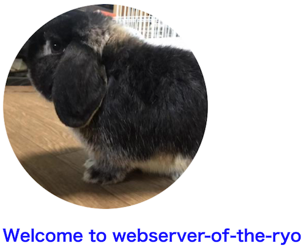

## やること

Go で http 通信する簡易 Web サーバを書く

## なぜ

基本こういった web サーバはライブラリで用意されたメソッド(↓ は net/http による実装例)で簡単に立ち上げられるようになっているが、
もう少し低レイヤというか、結局 http サーバは何をしているのか理解したかった(といっても結局 net/http の struct とか 使ってますが、、、)  
Go で書いた理由は単純に触ってみたかったからです

```go
import (
	"io"
	"log"
	"net/http"
)

func main() {
	h1 := func(w http.ResponseWriter, _ *http.Request) {
		io.WriteString(w, "Hello World\n")
	}

	http.HandleFunc("/", h1)

	log.Fatal(http.ListenAndServe(":8080", nil))
}
```

## 書いたもの

[こちら](https://github.com/RyoMasumura1201/webserver-of-the-ryo)がリポジトリになります。
とりあえず HTML ファイル, CSS ファイル, 画像ファイルでレスポンスを返すようにはなりました



### リクエストを受け取る

```go
func main() {
	fmt.Println("server start🚀")
	ln, err := net.Listen("tcp", ":8080")

	if err != nil {
		log.Fatal(err)
	}

	for {
		conn, err := ln.Accept()

		if err != nil {
			log.Fatal(err)
		}

		go handleRequest(conn)

	}
}
```

まず、`net.Listen()`で tcp 接続を待ち受けるようになります。  
無限ループ内でリクエストがくると`ln.Accept()`により`net.Conn`インターフェースを作成し、
`handleReqeust()`によりレスポンスを並列で返していきます

### リクエストを読み込む

```go
func handleRequest(conn net.Conn) {
	data := make([]byte, 1024)
	count, _ := conn.Read(data)
	fmt.Println(string(data[:count]))
	request := string(data[:count])

	requestElementList := splitRequest(request)
	requestLine := requestElementList[0]
	fmt.Println(requestElementList[0])

	_, path, _ := splitRequestLine(requestLine)
	fmt.Println(path)

	response := makeResponse(path)

	response.Write(conn)
	conn.Close()
}

func splitRequest(request string) []string {
	reg := "\r\n|\n"

	requestElementList := regexp.MustCompile(reg).Split(request, -1)

	return requestElementList
}

func splitRequestLine(requestLine string) (method, path, version string) {
	requestLineList := strings.Split(requestLine, " ")
	method = requestLineList[0]
	path = requestLineList[1]
	version = requestLineList[2]
	return
}
```

`conn.Read()`によりリクエスト内容を読み込む(標準出力結果がこちら)

```
GET /index.html HTTP/1.1
Host: localhost:8080
Connection: keep-alive
Cache-Control: max-age=0
sec-ch-ua: ".Not/A)Brand";v="99", "Google Chrome";v="103", "Chromium";v="103"
sec-ch-ua-mobile: ?0
sec-ch-ua-platform: "macOS"
Upgrade-Insecure-Requests: 1
User-Agent: Mozilla/5.0 (Macintosh; Intel Mac OS X 10_15_7) AppleWebKit/537.36 (KHTML, like Gecko) Chrome/103.0.0.0 Safari/537.36
Accept: text/html,application/xhtml+xml,application/xml;q=0.9,image/avif,image/webp,image/apng,*/*;q=0.8,application/signed-exchange;v=b3;q=0.9
Sec-Fetch-Site: none
Sec-Fetch-Mode: navigate
Sec-Fetch-User: ?1
Sec-Fetch-Dest: document
Accept-Encoding: gzip, deflate, br
Accept-Language: ja,en-US;q=0.9,en;q=0.8
```

リクエストの一行目にあるリクエストラインからリクエストパスを取り出し、レスポンス作成関数に渡します

```go
requestElementList := splitRequest(request)
requestLine := requestElementList[0]

_, path, _ := splitRequestLine(requestLine)
fmt.Println(path)

response := makeResponse(path)
```

### レスポンスを作成し、返す

```go
func makeResponse(path string) http.Response {

	header := http.Header{}
	header.Add("Host", "webserver-of-the-ryo/0.1")
	header.Add("Date", time.Now().Format(time.UnixDate))
	header.Add("Connection", "Close")

	responseContents, err := getResponseContents(path)

	mime := getMimeMap()
	var ext string
	if strings.Contains(path, ".") {
		array := strings.Split(path, ".")
		ext = array[len(array)-1]
	} else {
		ext = ""
	}

	var response http.Response

	if err != nil {
		responseContents = "<html><body><h1>404 Not Found</h1></body></html>"
		response = http.Response{
			StatusCode:    404,
			ProtoMajor:    1,
			ProtoMinor:    0,
			ContentLength: int64(len(responseContents)),
			Body:          ioutil.NopCloser(strings.NewReader((responseContents))),
		}

		header.Add("Content-Type", "text/html")
	} else {
		response = http.Response{
			StatusCode:    200,
			ProtoMajor:    1,
			ProtoMinor:    0,
			ContentLength: int64(len(responseContents)),
			Body:          ioutil.NopCloser(strings.NewReader((responseContents))),
		}

		contentType, isExists := mime[ext]

		if isExists {
			header.Add("Content-Type", contentType)
		} else {
			header.Add("Content-Type", "application/octet-stream")
		}
	}

	fmt.Println(responseContents)

	response.Header = header

	return response
}

func getMimeMap() map[string]string {
	mime := make(map[string]string)
	mime["html"] = "text/html"
	mime["css"] = "text/css"
	mime["png"] = "image/png"
	mime["jpg"] = "image/jpg"
	mime["gif"] = "image/gif"
	mime["ico"] = "image/x-icon"

	return mime
}
```

リクエストパスからファイルを読み込み、レスポンスボディとレスポンスヘッダを作成する  
指定されたファイルがない場合は、404 Not Found を返す

```go
responseContents, err := getResponseContents(path)

if err != nil {
	responseContents = "<html><body><h1>404 Not Found</h1></body></html>"
	response = http.Response{
		StatusCode:    404,
		ProtoMajor:    1,
		ProtoMinor:    0,
		ContentLength: int64(len(responseContents)),
		Body:          ioutil.NopCloser(strings.NewReader((responseContents))),
	}

	header.Add("Content-Type", "text/html")
} else {
	response = http.Response{
		StatusCode:    200,
		ProtoMajor:    1,
		ProtoMinor:    0,
		ContentLength: int64(len(responseContents)),
		Body:          ioutil.NopCloser(strings.NewReader((responseContents))),
	}

	contentType, isExists := mime[ext]

	if isExists {
		header.Add("Content-Type", contentType)
	} else {
		header.Add("Content-Type", "application/octet-stream")
	}
}
```

また、読み込んだファイルの拡張子からレスポンスヘッダの Content-Type を選んでいる

```go
mime := getMimeMap()
var ext string
if strings.Contains(path, ".") {
	array := strings.Split(path, ".")
	ext = array[len(array)-1]
} else {
	ext = ""
}

contentType, isExists := mime[ext]

if isExists {
	header.Add("Content-Type", contentType)
} else {
	header.Add("Content-Type", "application/octet-stream")
}

func getMimeMap() map[string]string {
	mime := make(map[string]string)
	mime["html"] = "text/html"
	mime["css"] = "text/css"
	mime["png"] = "image/png"
	mime["jpg"] = "image/jpg"
	mime["gif"] = "image/gif"
	mime["ico"] = "image/x-icon"

	return mime
}
```

## 最後に

対応すべき点をあげ出したらキリがないが、Get リクエストに対してレスポンスを返すサーバができた。  
[この方の Zenn](https://zenn.dev/hsaki)がめちゃめちゃ参考になりました  
net/http 読んで疑問になったことを色々解説してくださっててありがたかった、、、  
実装自体は[こちら](https://zenn.dev/bigen1925/books/introduction-to-web-application-with-python)を参考にさせていただきました

今回 net/http 読んでみましたがまだ把握できていない箇所が多いので何回かトライしてみようと思います  
あと次は WebSocket も理解していきたい
