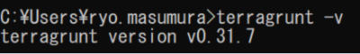

Terraform のラッパーツールである Terragrunt を用いることで、Terraform コードを DRY にし、保守性をより高く保つことができる。使用方法、利点などをまとめる。

## インストール(windows)

1. [GitHub](https://github.com/gruntwork-io/terragrunt/releases)にアクセス
2. Terragrunt をダウンロード(今回は terragrunt_windows_amd64.exe)
3. ダウンロードした exe ファイルの名称を terragrunt.exe に変更
4. ファイルを適当なディレクトリに配置し、パスを通す
5. ターミナルで terragrunt -v と入力し確認



## 使用方法

例として以下のようなディレクトリ構成を用いる。

```
├── network
│ └── main.tf
├── ec2
│ └── main.tf
```

1. terraform を実行する各ディレクトリ(今回は network,ec2)に terragrunt.hcl(設定ファイル)を配置

```hcl:network/terragrunt.hcl
   include {
     path = find_in_parent_folders()
   }
```

この記述により親ディレクトリの terragrunt.hcl を参照するようになる

2. 一つ上のディレクトリにも terragrunt.hcl を配置

```hcl:terragrunt.hcl
remote_state {
  backend = "s3"
  config = {
    bucket  = "example-tfstate"
    key     = "dev/${path_relative_to_include()}.tfstate"
    region  = "ap-northeast-1"
    encrypt = true
  }

  generate = {
    path      = "backend.tf"
    if_exists = "overwrite_terragrunt"
  }
}
```

これにより tfstate 用の s3 バケットを一括で設定できる

3. 親ディレクトリで実行(terraform ではなく、terragrunt コマンドを用いる)

```
 $ terragrunt  run-all apply
```

親ディレクトリで実行すると全ての子ディレクトリ(network,ec2)の terraform コードをまとめて実行できる。子ディレクトリで実行すると、子ディレクトリ内の terraform コードのみ実行できる。(子ディレクトリで実行する場合は terragrunt apply)

このように親ディレクトリの terragrunt.hcl に remote_state の設定を記述することで、子ディレクトリを一括で扱えるようになる。また、以下のように記述することで各ディレクトリに provider を配置することもできる。

```hcl:terragrunt.hcl
generate "provider" {
  path      = "provider.tf"
  if_exists = "overwrite_terragrunt"
  contents = <<EOF

terraform {
  required_providers {
    aws = {
      source  = "hashicorp/aws"
      version = "3.55.0"
    }
    mysql = {
      source  = "terraform-providers/mysql"
      version = "1.9.0"
    }
  }

  required_version = "1.0.4"
}
~ provider情報を書く ~
EOF
}

```

## Terragrunt で各ディレクトリの依存関係を管理する

例えば network ディレクトリの main.tf で記述されている subnet の id を ec2 ディレクトリの ec2.tf で参照したいとき、各ディレクトリの依存関係を terragrunt で管理できる

1. 参照するデータを output で tfstate に記述する

```hcl:network/main.tf
  resource "aws_vpc" "this" {
    cidr_block  = "10.1.0.0/16"
    instance_tenancy     = "default"
  }

  resource "aws_subnet" "this" {
    availability_zone = "ap-northeast-1a"
    cidr_block = "10.1.0.0/24"
    vpc_id = aws_vpc.this.id
  }

  output "subnet_id" {
    value = aws_subnet.this.id
  }
```

2. ディレクトリの依存関係を依存する側の terragrunt.hcl に記述する

```hcl:ec2/terragrunt.hcl
   include {
     path = find_in_parent_folders()
   }

   dependency "network" {
     config_path = "../network"

     // terragrunt plan用のダミーデータを作成
     mock_outputs = {
       subnet_id = "dummy"
     }

     mock_outputs_allowed_terraform_commands = ["plan"]
   }

// 依存先の tfstate の outputs を取得
inputs = {
subnet_id = dependency.network.outputs.subnet_id
}

```

3. 依存先の outputs の値を変数として用いる

```hcl:ec2/main.tf

variable "subnet_id" {
 type = string
}

resource "aws_instance" "this" {
 ami = "ami-09ebacdc178ae23b7"

 instance_type     = "t2.micro"
 availability_zone = "ap-northeast-1a"
 subnet_id         = var.subnet_id //変数として参照
}
```

## まとめ

Terragrunt を用いることで Terraform コードを DRY にし、ディレクトリ間の依存関係を記すことで保守性をより高く保つことができる。

## 参考情報

- [GitHub](https://github.com/gruntwork-io/terragrunt/releases)
- [Terragrunt についての記事 1](https://dev.classmethod.jp/articles/intro-terragrunt/)
- [Teragrunt についての記事 2](https://dev.classmethod.jp/articles/terragrunt-makes-your-terraform-backend-code-dry/)
