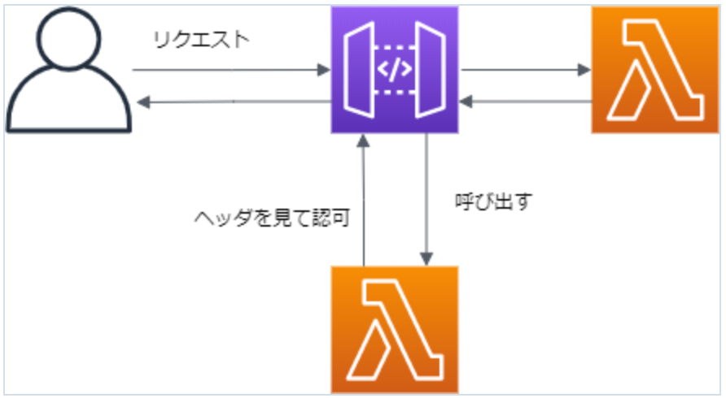

# やること

HTTP API はリクエストに対して IAM, JWT, Lambda といった方法で認証認可を行い、アクセスを制御することができる。  
Lambda を用いて、リクエストの Authorization ヘッダの値による認可を実装する。



# 構築

SAM で APIGW, 認証用 lambda を構築する。

```yaml:template.yaml
AWSTemplateFormatVersion: '2010-09-09'
Transform: AWS::Serverless-2016-10-31

Globals:
  Function:
    Timeout: 3

# APIGWの作成
APIGW:
  Type: AWS::Serverless::HttpApi
  Properties:
    StageName: dev
    Auth:
    DefaultAuthorizer: LambdaAuthorizer
    # lambda認証の設定
    Authorizers:
      LambdaAuthorizer:
      FunctionArn: !Ref AuthLambda
      EnableSimpleResponses: true
      AuthorizerPayloadFormatVersion: 2.0
      Identity:
      Headers:
      - Authorization

# 認証用Lambda
AuthLambda:
  Type: AWS::Serverless::Function
  Properties:
    CodeUri: auth/
    Handler: app.lambda_handler
    Runtime: python3.9
    FunctionName: apigw-auth-lambda

# APIGWの統合先Lambda。実装は省きます
HelloLambda:
  Type: AWS::Serverless::Function
  Properties:
    FunctionName: hello-lambda
    CodeUri: hello/
    Handler: app.lambda_handler
    Runtime: python3.9
    Architectures:
      - x86_64
    Events:
      Hello:
        Type: HttpApi
        Properties:
          ApiId: !Ref APIGW
          Path: /hello
          Method: get
```

APIGW の`Authorizers`で Lambda 認証の設定を行っています。  
認証 Lambda からのレスポンスは 1.0 と 2.0 の二つのバージョンがあるのですが、2.0 においては許可/拒否の boolean を返すか、リクエストに付与する policy を返すかで形式を選択することができます。  
権限の詳細を細かく設定するなら policy を返すことになりますが、今回は`EnableSimpleResponses: true`にて boolean を返すように設定しました。

```json:SimpleResponseのレスポンス形式
{
  "isAuthorized": true/false,
  "context": {
    "exampleKey": "exampleValue"
  }
}
```

また、`DefaultAuthorizer`に Lambda を指定することで各メソッドに自動で Lambda 認証が設定されるようになっています。

続いて認証用 Lambda を実装します。

```py:auth/app.py
def lambda_handler(event, context):

    response = {
        "isAuthorized": False
    }

    if event["headers"]["authorization"] == "secretkey":
        response = {
            "isAuthorized": True
        };

    return response;
```

Authorization ヘッダの値が指定の文字列(secretkey)であれば`isAuthorized: true`を返すようにしています。  
**_例では指定の文字列をハードコーディングしていますが、Secrets Manager 等で管理した方が安全です_**

以上の設定により Authorization ヘッダを付与したリクエストだけを後段の Lambda に通すようになります。

# 参考記事

- [https://docs.aws.amazon.com/ja_jp/apigateway/latest/developerguide/http-api-lambda-authorizer.html](https://docs.aws.amazon.com/ja_jp/apigateway/latest/developerguide/http-api-lambda-authorizer.html)
- [https://dev.classmethod.jp/articles/http-api-support-iam-and-lambda-authorizer/](https://dev.classmethod.jp/articles/http-api-support-iam-and-lambda-authorizer/)
