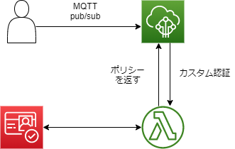
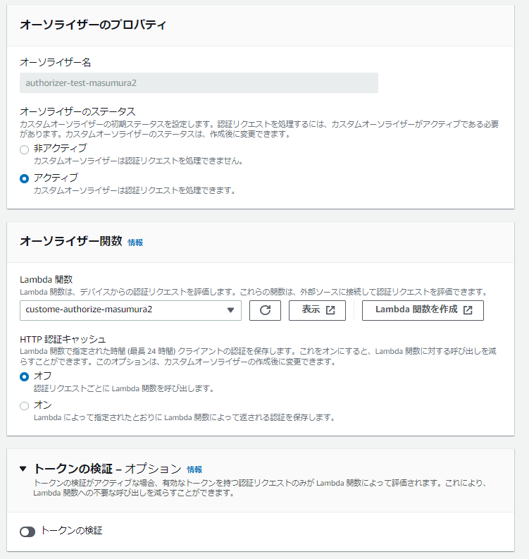

# やること

AWS IoT Core のカスタム認証機能を用いて証明書を用いずに、MQTT 通信の権限を管理する。
Cognito のフェデレーティッド ID と IoT Core のポリシーを連携する方法もあるが、カスタム認証時動作する Lambda 上で Cognito 認証することで簡易的に Cognito による MQTT pub/sub の権限管理を行う。

# 認証の構成



# 手順

## Cognito にてユーザープールとユーザーを作成

Cognito のユーザープール、アプリクライアント、ユーザーを作成しておく。

## IoT Core のポリシーを返却する Lambda を作成

以下の Lambda を作成。AWS SDK により Cognito 認証を行い、成功すれば IoT Core に関するポリシーを返す。
環境変数(ClientID)として Cognito のアプリクライアント ID を設定する。

```js
const aws = require('aws-sdk');
const cognito = new aws.CognitoIdentityServiceProvider();

exports.handler = async function (event, context, callback) {
  const originalUserName = event.protocolData.mqtt.username;
  // AWS SDKでMQTTpublishした際、usernameは"ユーザ名?SDK=PythonV2&Version=xx"として渡されるのでユーザ名を抽出
  const uname = originalUserName.substring(0, originalUserName.indexOf('?'));
  const pwd = event.protocolData.mqtt.password;
  // passwordはBase64エンコーディングされた値が渡されるのでデコードして使用
  const passwd = Buffer.from(pwd, 'base64').toString('ascii');

  const params = {
    AuthFlow: 'USER_PASSWORD_AUTH',
    ClientId: process.env['ClientID'],
    AuthParameters: {
      USERNAME: uname,
      PASSWORD: passwd,
    },
  };

  const result = await cognito
    .initiateAuth(params)
    .promise()
    .catch((error) => {
      callback(null, generateAuthResponse('Deny'));
    });

  callback(null, generateAuthResponse('Allow'));
};

// Helper function to generate the authorization response.
const generateAuthResponse = function (effect) {
  const authResponse = {};
  authResponse.isAuthenticated = true;
  authResponse.principalId = 'TEST123';

  const policyDocument = {};
  policyDocument.Version = '2012-10-17';
  policyDocument.Statement = [];
  const publishStatement = {};
  const connectStatement = {};
  connectStatement.Action = ['iot:Connect'];
  connectStatement.Effect = effect;
  connectStatement.Resource = ['arn:aws:iot:ap-northeast-1:************:client/*'];
  publishStatement.Action = ['iot:Publish'];
  publishStatement.Effect = effect;
  publishStatement.Resource = ['arn:aws:iot:ap-northeast-1:************:topic/test/*'];
  policyDocument.Statement[0] = connectStatement;
  policyDocument.Statement[1] = publishStatement;
  authResponse.policyDocuments = [policyDocument];
  authResponse.disconnectAfterInSeconds = 3600;
  authResponse.refreshAfterInSeconds = 300;

  return authResponse;
};
```

## オーソライザーの作成

AWS IoT のマネジメントコンソールのナビゲーションペインからセキュリティ>オーソライザーを開き、オーソライザーの作成をクリック。
オーソライザーの設定画面が開くので、各設定を入力。
Lambda 関数は先ほど作成した関数を指定。作成をクリック。


## 作成したオーソライザーをデフォルトに設定する

この設定は CLI でしか行えない。

```
aws iot set-default-authorizer --authorizer-name <authorizer_name>
```

## オーソライザーが Lambda を呼び出せるように Lambda にポリシーを設定

```
aws lambda add-permission --function-name <lambda_function_name> --principal iot.amazonaws.com --source-arn <authorizer_arn> --statement-id Id-123 --action "lambda:InvokeFunction"
```

準備完了。以下コードを実行し、MQTT publish を行う。

```py
from awscrt import io, mqtt
from awsiot import mqtt_connection_builder

ENDPOINT = "xxxxxxxxxxxxxxxx-ats.iot.ap-northeast-1.amazonaws.com"
CLIENT_ID = "testDevice"

MESSAGE = "Hello World"
TOPIC = "test/testing"

try:
    mqtt_connection = mqtt_connection_builder.direct_with_custom_authorizer(
                auth_username="<cognitoのusername>",
                auth_password="<cognitouserのpassword>",
                endpoint=ENDPOINT,
                client_id=CLIENT_ID,
                clean_session=False,
                )
    print("Connecting to {} with client ID '{}'...".format(
            ENDPOINT, CLIENT_ID))
    # Make the connect() call
    connect_future = mqtt_connection.connect()
    # Future.result() waits until a result is available
    connect_future.result()
    print("Connected!")
    # Publish message to server desired number of times.
    print('Begin Publish')

    message = {"message" : MESSAGE}
    mqtt_connection.publish(topic=TOPIC, payload=json.dumps(message), qos=mqtt.QoS.AT_LEAST_ONCE)
    print("Published: '" + json.dumps(message) + "' to the topic: " + "'test/testing'")
    print('Publish End')
    disconnect_future = mqtt_connection.disconnect()
    disconnect_future.result()
except Exception as e:
  print(e)
```

これにより Cognito ユーザの認証情報を用いて IoT Core に MQTT メッセージを送ることができる。

# 参考記事

- [https://docs.aws.amazon.com/ja_jp/iot/latest/developerguide/config-custom-auth.html](https://docs.aws.amazon.com/ja_jp/iot/latest/developerguide/config-custom-auth.html)
- [https://qiita.com/morikaz/items/2228d24f73ae422c9eac](https://qiita.com/morikaz/items/2228d24f73ae422c9eac)
