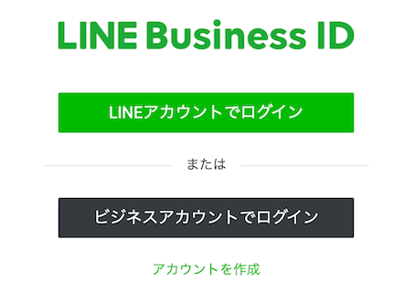

ゴミの日が本当に覚えられない。  
大体当日の収集時間前後に気付くのだが、前日には各部屋のゴミを集めておかないととてもじゃないが間に合わない。  
というわけで前日の夜に通知する LineBot を作った。

## Bot 用の Line アカウント作成

初めに通知するための Line アカウントを作成する。

### Line Developers にログイン

まず、[Line Developers](https://developers.line.biz/ja/)にログインする。(個人用、もしくはビジネス用のアカウントを持っていればログインできる。)  
今回は個人開発のため、LINE アカウントでログインを選択。



### プロバイダーを作成

プロバイダーとはサービス提供者、開発者のこと。  
コンソールのホーム画面にある作成ボタンをクリック。


### チャネル作成

チャネル(通知用の LINE アカウント)を作成する。
コンソール画面のヘッダーからプロダクトを選択。  
今回はコード上で API 叩いてメッセージを送信させる予定なので Messaging API を選択。


各情報を入力し、作成。
プロバイダには先ほど作成したプロバイダを選択。  
プライバシーポリシー URL,サービス利用規約 URL は今回は省略。


### 秘密鍵とトークンを取得

作成したチャネルのチャネル基本設定からチャネルシークレット(秘密鍵)を発行。


MessaginAPI 設定からチャネルアクセストークン(長期)を取得。


コード上で API を叩く時に用いる。  
これで Line 側の設定は完了。

## Messaging API を叩くコードを作成。

ローカルに新規ディレクトリを作成し、package.json を作成。

```
 $ npm init -y
```

Messaging API 用のライブラリをインストール。

```
 $ npm i @line/bot-sdk
```

ディレクトリ直下に index.js を作成。

```js:index.js
const line = require("@line/bot-sdk");

const config = {
  channelAccessToken: process.env.LINE_CHANNEL_ACCESS_TOKEN,
  channelSecret: process.env.LINE_CHANNEL_SECRET,
};

const client = new line.Client(config);
exports.handler = async (event) => {
  const date = new Date();
  const week = date.getDay();

  let text;
  switch (week) {
    case 1:
    case 4:
      text = "明日は燃えるゴミ(家庭ゴミ)の日です!";
      break;
    case 2:
      text = "明日は缶・ビン・ペットボトルゴミの日です!";
      break;
    case 3:
      text = "明日はプラスチック容器包装ゴミの日です!";
      break;
    case 5:
      date.setDate(date.getDate() + 1);
      const tomorrowDate = date.getDate();
      if (1 <= tomorrowDate && tomorrowDate <= 7) {
        text = "明日は段ボールの回収日です!";
      }
  }

  const messages = [
    {
      type: "text",
      text: text,
    },
  ];

  if (text) {
    try {
      // メッセージ送信
      const res = await client.broadcast(messages);
      console.log("成功");
      console.log(res);
    } catch (error) {
      console.log(`エラー: ${error.statusMessage}`);
      console.log(error.originalError.response.data);
    }
  }
};

```

ディレクトリ直下のコードをまとめて zip 化する。

## Lambda 作成

先ほど設定した API を叩くコードを定期実行する Lambda を作成する。  
AWS コンソールにログインし、Lambda から関数の作成をクリック。  
一から作成を選択し、関数名を入力し作成。(今回は Nodejs で書きます。アクセス権限はデフォルトで OK)


コードタブのアップロードボタンをクリック。  
zip ファイルを選択し、先ほど作成した zip ファイルをアップロード。


## Lambda を定期実行させる

AWS の EventBridge ページに移動し、ルールを作成する。
パターンを定義にてスケジュールを選択し、Cron 式(定期実行するタイミングを表す)を入力。


ターゲットを選択にて先ほど作成した Lambda 関数を選択。


これにてメッセージを定期実行するアカウントを作成できた。
