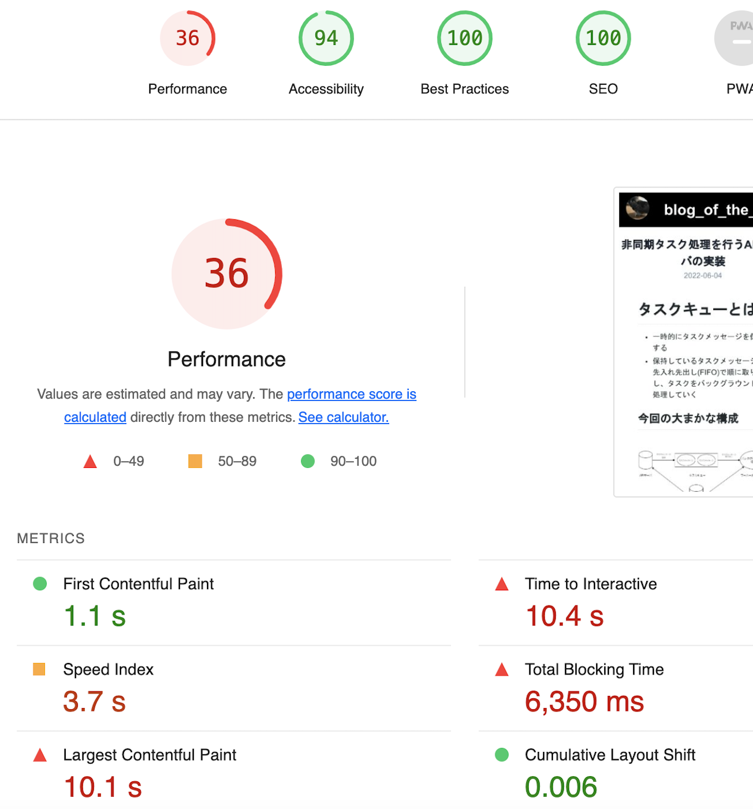
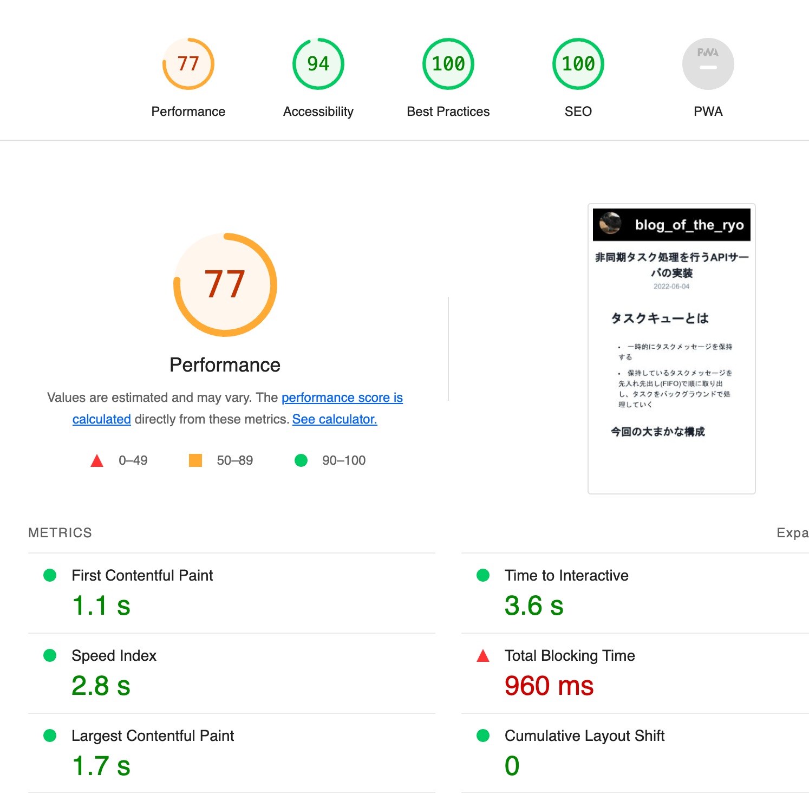

# やったこと

本ブログサイトにおける markdown レンダリング処理部分を React Markdown から unified に変更した

# なぜ

本ブログサイトは Next.js で動いており、SSG(静的サイト生成)によりレンダリングしている。  
各記事ページにおいてはリポジトリに push した md ファイルからコンテンツを読み込み、React Markdown により markdown=>HTML への変換処理を行なっていた。

```tsx:src/pages/posts/[id].tsx
export default function Post(props: Props) {
  const { postData } = props;

  const Img = ({ node, children }: { node: JSX.IntrinsicElements['p']; children: ReactNode[] }) => {
    if (node.children[0].tagName === 'img') {
      const image = node.children[0];

      return (
        <picture>
          <Image
            src={require(`../../../posts/${postData.id}/${image.properties.src}`)}
            alt={image.properties.alt}
            objectFit='contain'
          />
        </picture>
      );
    }
    return <p>{children}</p>;
  };

  return (
    <Layout>
      <article>
        {/* ~~省略~~ */}

        <Box
          paddingLeft={{ base: '10', md: '40' }}
          paddingRight={{ base: '10', md: '40' }}
          className={markdownStyles.markdownBody}
        >
          <ReactMarkdown remarkPlugins={[gfm]} components={{ code: CodeBlock, p: Img }}>
            {postData.content}
          </ReactMarkdown>
        </Box>
      </article>
    </Layout>
  );
}
```

つまり静的生成しているにも関わらず、markdown を HTML に変換する処理はクライアント側で行っていることになる。  
サーバ側で完結できる処理はできるだけサーバ側で完結させた方がパフォーマンス的にも良いと思う。  
React Markdown は簡単に markdown 処理ができてとても便利だが、クライアント側で処理を行うライブラリのため、unified に移行することにした。  
↓ は Light House の結果。明らかにパフォーマンスのスコアが低い。



# unified とは

コンテンツを構造化データとして扱う 500 以上のフリーでオープンソースのパッケージの集合体(DeepL 訳)  
と[リポジトリ](https://github.com/unifiedjs/unified)にあるように、複数のプラグインを組み合わせてテキストデータやテキストデータを構造化したデータ(AST)を変換していくライブラリである。  
プラグインを独自に作成し、噛ませることもできる。
markdown 処理においては今回は以下の流れで変換していく。

1. markdown を構造化したデータ(mdast)に変換
2. mdast を hast(html を構造化したデータ)に変換
3. hast を html に変換
4. html を React Element に変換

# 実装

## 全体の流れ

getStaticProps 内で unified により markdown=>html の変換処理を行う。
以下のように`unified().use()`で複数の plugin を markdown コンテンツに噛ませていき、得られた html を props として各記事ページに渡していく。  
渡した html を元に react-rehype で React コンポーネントに変換する。

```ts:lib/posts.ts
import { unified } from 'unified';
import parser from 'remark-parse';
import remarkRehype from 'remark-rehype';
import compiler from 'rehype-stringify';
import rehypePrism from 'rehype-prism-plus';
import { plugin, fileNamehandler, codeBlockHandler } from './transformer';
import type { Options as RemarkRehypeOptions } from 'remark-rehype';

// ~~省略~~

export const getPostData = async (id: string) => {
  const fullPath: string = path.join(postsDirectory, id, 'index.md');
  const fileContents: string = fs.readFileSync(fullPath, `utf8`);

  const matterResult: matter.GrayMatterFile<string> = matter(fileContents);

  const processor = unified()
    .use(parser) // markdownをmdastに変換
    .use(plugin) // mdastを一部修正
    .use(remarkRehype, { //mdastをhastに変換
      handlers: {
        fileName: fileNamehandler,
        codeBlock: codeBlockHandler,
      },
    } as RemarkRehypeOptions)
    .use(rehypePrism) //Code Blockのsyntax highlight
    .use(compiler); // hastをHTML形式のテキストに変換

  const html = await processor.process(matterResult.content);

  return {
    id,
    html: html.toString(),
    ...(matterResult.data as { date: string; title: string; image: string }),
  };
};
```

```tsx:pages/posts/[id].tsx
export default function Post(props: Props) {
  const { postData } = props;
  // ~~省略~~

  return (
    <Layout>
      <article>
      {/* ~~省略~~ */}
        <Box paddingLeft={{ base: '10', md: '40' }} paddingRight={{ base: '10', md: '40' }}>
          <div className={markdownStyles.body}>{RehypeReact(postData.html)}</div>
        </Box>
      </article>
    </Layout>
  );
}
export const getStaticProps: GetStaticProps = async ({ params }) => {
  const postData = await getPostData(params.id as string);
  return {
    props: {
      postData,
    },
  };
};
```

## Code Block にファイル名をつける

Zenn や Qiita のように Code Block 部分で言語の次に指定したファイル名(ex. `ts:hoge.ts`)を表示できるようにする。

今回は 以下の流れで実装する。

- mdast を変換し、ファイル名表示用の Node を Code Block 部分に追加するプラグインを作成
- mdast=>hast への変換時に追加したファイル名表示 Node に CSS クラスを当てていく。

### mdast を変換

まず plugin を作成し、Code Block 部分の mdast を変換していく。

```ts:lib/transformer.ts
import unified from 'unified';
import { visit } from 'unist-util-visit';

export const plugin: unified.Plugin = () => {
  return (tree: Node, _file: VFileCompatible) => {
    visit(tree, isCode, visitor);
  };
};

function isCode(node: unknown): node is Code {
  return isNode(node) && node.type === 'code';
}

function isObject(target: unknown): target is { [key: string]: unknown } {
  return typeof target === 'object' && target !== null;
}
function isNode(node: unknown): node is Node {
  return isObject(node) && 'type' in node;
}

const visitor = (node: Code, index: number, parent: Parent | undefined) => {
  if (!node.lang) {
    node.lang = 'sh';
    return;
  }

  const langAndName = node.lang.split(':');

  if (langAndName.length < 2) {
    const codeBlock = { type: 'codeBlock', children: [node] };
    parent.children.splice(index, 1, codeBlock);
    return;
  }

  const lang = langAndName[0];
  const fileName = langAndName[1];

  node.lang = lang;
  node.value = '\n' + node.value; // ファイル名を表示するための空行を先頭に追加
  const fileNameNode = { type: 'fileName', value: fileName };
  const codeBlock = { type: 'parentCodeBlock', children: [fileNameNode, node] };
  parent.children.splice(index, 1, codeBlock);
};
```

unist-util-visit で提供されている `visit(tree[, test], visitor[, reverse])`は test(今回は isCode)で変換したい Node を識別し、visitor で実際の変換処理を行う。  
今回は検出した Code Block にファイル名の記載があった場合、ファイル名表示用 Node と Code Block を子に持つ Node を生成し、Code Block からその Node に置き換える処理を行なっている。

### mdast=>hast への変換

mdast=>hast への変換は remark-rehype で行う。  
この時、先ほど作成したファイル名表示用 Node と親 Node に className を与える。

```ts
import { H, all } from 'mdast-util-to-hast';
import { MdastNode } from 'mdast-util-to-hast/lib/traverse';

const processor = unified()
  .use(parser)
  .use(plugin)
  .use(remarkRehype, {
    handlers: {
      fileName: fileNamehandler,
      parentCodeBlock: parentCodeBlockHandler,
    },
  } as RemarkRehypeOptions)
  .use(rehypePrism)
  .use(compiler);

export const fileNamehandler = (_h: H, node) => {
  return {
    type: 'element',
    tagName: 'div',
    properties: {
      className: ['fileName'],
    },
    children: [{ type: 'text', value: node.value }],
  };
};

export const parentCodeBlockHandler = (h: H, node: MdastNode) => {
  return {
    type: 'element',
    tagName: 'div',
    properties: {
      className: ['parentCodeBlock'],
    },
    children: all(h, node),
  };
};
```

```css
.fileName {
  background-color: #edf2f7;
  position: absolute;
  padding: 3px;
}

.parentCodeBlock {
  position: relative;
}
```

これによりあらかじめ CSS で指定していた class が適用され、コードブロックにファイル名が表示される。

## 画像は next/image で最適化させる

せっかく Next.js を使っているので、画像は next/image で最適化させたい。  
コンポーネントを指定する必要があるので、こちらの処理は rehype-react にてクライアントサイドで行う。

```tsx:src/pages/posts/[id].tsx
import { unified } from 'unified';
import rehypeParse from 'rehype-parse';
import rehypeReact from 'rehype-react';
import type { Options as RehypeReactOptions } from 'rehype-react';

export default function Post(props: Props) {
  const { postData } = props;

  const ImageElement: React.VFC<ImageElementProps> = (props) => {
    const { src, alt } = props;
    return (
      <picture>
        <Box style={{ position: 'relative', minHeight: '20em', width: '100%' }}>
          <Image
            src={require(`../../../posts/${postData.id}/${src}`)}
            alt={alt}
            layout='fill'
            objectFit='contain'
          />
        </Box>
      </picture>
    );
  };

  const RehypeReact = (html: string) => {
    const result = unified()
      .use(rehypeParse, {
        fragment: true,
      })
      .use(rehypeReact, {
        createElement: React.createElement,
        components: {
          img: (props: ImageElementProps) => {
            return ImageElement(props);
          },
        },
      } as RehypeReactOptions)
      .processSync(html);
    return result.result;
  };

  return (
    <Layout>
      <article>
        {/* ~~省略~~ */}
        <Box paddingLeft={{ base: '10', md: '40' }} paddingRight={{ base: '10', md: '40' }}>
          <div className={markdownStyles.body}>{RehypeReact(postData.html)}</div>
        </Box>
      </article>
    </Layout>
  );
}
```

rehype-react にて、img のみ next/image を用いた React コンポーネントに変換する。  
これにより、markdown 内の画像を next/image で表示できる。

# 結果、最後に

markdown=>html 処理を unified で行った。  
Light House のスコアは以下のようになった。とりあえずパフォーマンススコアはかなり改善されている(嬉しい)。


まだ改善点は色々残っており、そもそもそこまでパフォーマンス上がってるか？という気持ちもあるのでちょくちょく手を入れていきたい。

# 参考にさせていただいたブログ

- [https://www.haxibami.net/blog/posts/blog-renewal](https://www.haxibami.net/blog/posts/blog-renewal)
- [https://blog.ojisan.io/](https://blog.ojisan.io/)
- [https://zenn.dev/januswel/articles/745787422d425b01e0c1](https://zenn.dev/januswel/articles/745787422d425b01e0c1)
