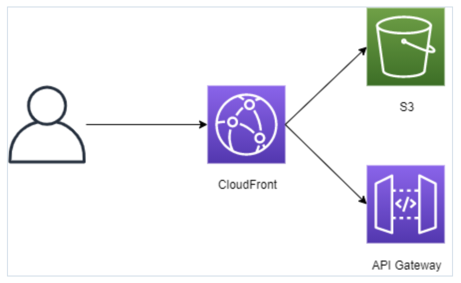

# やること

CloudFront はオリジンを複数持つことができ、リクエストのパスによって振り分け先を変えることができます。  
S3(静的コンテンツ)と APIGW を同一の CloudFront から配信し、同一ドメインで管理します。



# 構築

静的コンテンツを置く S3 を作成します。OAC でアクセス制限するので、全てのパブリックアクセスはブロックしておきます。

```yaml
WebAppBucket:
  Type: AWS::S3::Bucket
  Properties:
    BucketName: webapp-bucket
      # 全てのパブリックアクセスをブロック
      PublicAccessBlockConfiguration:
        BlockPublicAcls: true
        BlockPublicPolicy: true
        IgnorePublicAcls: true
        RestrictPublicBuckets: true
      BucketEncryption:
        ServerSideEncryptionConfiguration:
        -
          ServerSideEncryptionByDefault:
            SSEAlgorithm: AES256
```

APIGW を SAM で作成します。api というステージを作成し、/hello でリクエストを待ち受けるようにします。

```yaml
AWSTemplateFormatVersion: '2010-09-09'
Transform: AWS::Serverless-2016-10-31
Resources:
  # APIGWの後段のLambda。実装は省略
  Lambda:
    Type: AWS::Serverless::Function
    Properties:
      FunctionName: test-function
      Handler: app.lambda_handler
      Runtime: python3.9
      Timeout: 5
      CodeUri: hello/
      Events:
        Hello:
          Type: Api
          Properties:
            Path: /hello
            Method: get
            RestApiId: !Ref API
  # APIGW
  API:
    Type: AWS::Serverless::Api
    Properties:
      Name: test-apigw
      EndpointConfiguration: REGIONAL
      StageName: api
```

CloudFront、キャッシュポリシーを作成します。S3 へのアクセスは OAC で制限するので OAC とバケットポリシーも作成します。  
/api に来たリクエストは APIGW に振り分け、その他は S3 に振り分けるように設定しています

```yaml
CloudFront:
  Type: AWS::CloudFront::Distribution
  Properties:
    DistributionConfig:
      Origins:
      -
        # S3オリジンの設定
        DomainName: !GetAtt WebAppBucket.DomainName
        Id: !GetAtt WebAppBucket.DomainName
        OriginAccessControlId: !GetAtt OAC.Id
        S3OriginConfig:
          OriginAccessIdentity: ""
      -
        # APIGWオリジンの設定
        DomainName: !Ref APIGWURL # 作成したAPIGWのurlをパラメータで渡す
        Id: !Ref APIGWURL
        CustomOriginConfig:
          HTTPPort: 80
          HTTPSPort: 443
          OriginProtocolPolicy: https-only
      # S3オリジンへリクエストを振り分ける設定
      DefaultCacheBehavior:
        AllowedMethods:
        - "HEAD"
        - "GET"
        CachedMethods:
        - "HEAD"
        - "GET"
        Compress: true
        # CachingOptimized(AWSのマネージドキャッシュポリシー)
        CachePolicyId: 658327ea-f89d-4fab-a63d-7e88639e58f6
        TargetOriginId: !GetAtt WebAppBucket.DomainName
        ViewerProtocolPolicy: redirect-to-https
      CacheBehaviors:
      -
        # APIGWオリジンへリクエストを振り分ける設定
        AllowedMethods:
        - "HEAD"
        - "GET"
        - "POST"
        - "DELETE"
        - "OPTIONS"
        - "PUT"
        - "PATCH"
        Compress: true
        CachePolicyId: !Ref APIGWCachePolicy
        # /apiに来たリクエストをAPIGWに振り分ける
        PathPattern: api/*
        TargetOriginId: !Ref APIGWURL
        ViewerProtocolPolicy: "redirect-to-https"
        PriceClass: PriceClass_All
        Enabled: true
        ViewerCertificate:
          CloudFrontDefaultCertificate: true
        HttpVersion: http2

# キャッシュポリシー
APIGWCachePolicy:
  Type: "AWS::CloudFront::CachePolicy"
  Properties:
    CachePolicyConfig:
      Name: apigw-cachepolicy
      DefaultTTL: 1
      MaxTTL: 1
      MinTTL: 1
      ParametersInCacheKeyAndForwardedToOrigin:
        EnableAcceptEncodingGzip: true
        EnableAcceptEncodingBrotli: true
        CookiesConfig:
          CookieBehavior: "all"
        # オリジンへ転送するヘッダ
        HeadersConfig:
          HeaderBehavior: "whitelist"
          Headers:
          - "Authorization"
        QueryStringsConfig:
          QueryStringBehavior: "all"

OAC:
  Type: AWS::CloudFront::OriginAccessControl
  Properties:
    OriginAccessControlConfig:
      Name: webapp-oac
        OriginAccessControlOriginType: s3
        SigningBehavior: always
        SigningProtocol: sigv4

# バケットポリシー
WebAppBucketPolicy:
  Type: AWS::S3::BucketPolicy
  Properties:
    Bucket: !Ref WebAppBucket
    PolicyDocument:
      Version: 2012-10-17
      Id: PolicyForCloudFrontPrivateContent
      Statement:
      -
        Sid: AllowCloudFrontServicePrincipal
        Effect: Allow
        Principal:
          Service: cloudfront.amazonaws.com
        Action: s3:GetObject
        Resource: !Sub arn:aws:s3:::${WebAppBucket}/*
        Condition:
          StringEquals:
            AWS:SourceArn: !Sub arn:aws:cloudfront::${AWS::AccountId}:distribution/${CloudFront}
```

クライアントから来たリクエストを CloudFront がオリジンへ転送する際、リクエストのヘッダ、クエリ、Cookie は転送されません。  
そのためオリジンである APIGW に届けたいヘッダがある場合、オリジンリクエストポリシーもしくはキャッシュポリシーで設定する必要があります。今回はキャッシュポリシーにて Authorization ヘッダを転送するよう設定しています。

```yaml
ParametersInCacheKeyAndForwardedToOrigin:
  EnableAcceptEncodingGzip: true
  EnableAcceptEncodingBrotli: true
  # Cookieは全て転送
  CookiesConfig:
    CookieBehavior: 'all'
  # オリジンへ転送するヘッダを個別に指定
  HeadersConfig:
    HeaderBehavior: 'whitelist'
    Headers:
      - 'Authorization'
  # クエリは全て転送
  QueryStringsConfig:
    QueryStringBehavior: 'all'
```

Cookie、クエリで行っているようにヘッダも全て転送するよう設定することはできますが、全て転送すると Host ヘッダ(リクエストが送信される先のサーバーのホスト名とポート番号を示す)が CloudFront のまま APIGW へ転送されてしまい、APIGW 側で 403 エラーが発生してしまいます。そのため、個別で転送するヘッダを指定しています。

以上の設定により、同一 CloudFront から S3 上の静的コンテンツと APIGW を配信できます。

# 参考記事

- [https://dev.classmethod.jp/articles/cloudfront-multioriginbehavior/](https://dev.classmethod.jp/articles/cloudfront-multioriginbehavior/)
- [https://developer.mozilla.org/ja/docs/Web/HTTP/Headers/Host](https://developer.mozilla.org/ja/docs/Web/HTTP/Headers/Host)
