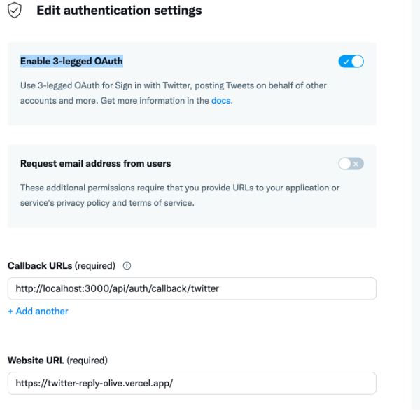
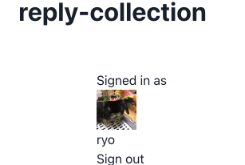

NextAuth による Twitter ログイン機能を実装した。  
つまづいた(主に Callback URL 設定)ので書いておく。

# Twitter Developer で App を作成

Twitter Developer の登録、App の作成方法は[こちら](https://www.itti.jp/web-direction/how-to-apply-for-twitter-api/)などを参考に。  
API Key と Secret Key はコピーしておく。

# URL 設定

Developer Portal の  権限設定(authentication settings)で Enable 3-legged OAuth を on にし、callbackurl を以下のように設定する。



## CallbackURL とは？

別のサイト、web アプリで処理を行なった後のリダイレクト先の URL  
今回は OAuth 認証後にセッション情報を返す URL 先を示す。  
[NextAuth 公式](https://next-auth.js.org/getting-started/rest-api)に記載されているように NextAuth は

```
/api/auth/callback/:provider
```

によって OAuth からのリクエストを処理するので、CallbackURL は上記のように設定する必要がある。

# 環境変数設定

.env.local ファイルを作成。コピーした API Key と Secret Key を環境変数として与える

```
TWITTER_CLIENT_ID="コピーしたAPI Key"
TWITTER_CLIENT_SECRET="コピーしたSecret Key"
```

# NextAuth のインストール、設定

ここから先はほぼ公式ドキュメント通り。

```bash
npm install next-auth
```

でインストール。  
\_app.tsx に provider を設定する

```tsx:pages/posts/_app.tsx
import { SessionProvider } from "next-auth/react"

export default function App({
  Component,
  pageProps: { session, ...pageProps },
}) {
  return (
    <SessionProvider session={session}>
      <Component {...pageProps} />
    </SessionProvider>
  )
}
```

公式ドキュメント通りに pages/api/auth 配下に[...nextauth].ts を作成する。  
こちら NextAuth の設定ファイルとなっており、以下のように記述することで Twitter ログイン用のページにリダイレクトしてくれるようになる。

```ts:pages/api/auth/[...nextauth].ts

import NextAuth from 'next-auth';
import Providers from 'next-auth/providers';

export default NextAuth({
  providers: [
    Providers.Twitter({
      clientId: process.env.TWITTER_CLIENT_ID,
      clientSecret: process.env.TWITTER_CLIENT_SECRET,
    }),
  ],
})

```

# ログイン画面作成

```tsx:index.tsx
import { useSession, signIn, signOut } from "next-auth/react"

export default function Component() {
  const { data: session } = useSession()
  if (session) {
    return (
      <>
        Signed in as 
          {session.user.name} <br />
        <button onClick={() => signOut()}>Sign out</button>
      </>
    )
  }
  return (
    <>
      Not signed in <br />
      <button onClick={() => signIn()}>Sign in</button>
    </>
  )
}
```

ログインボタンを作る。  
クリックすると Twitter ログインページに遷移するので、自身のアカウントでログインする。



成功すると、セッション情報を取得できる。

# まとめ

NextAuth による Twitter ログインの実装方法をかいた。
[Twitter developer の公式](https://developer.twitter.com/ja/docs/basics/apps/guides/callback-urls) だと callbackURL にローカルループバックアドレスを設定するよう書いているのだが、鵜呑みにしてそのままhttp://127.0.0.1 を設定していたので 403 エラーが出てしまい、詰まってしまった。

# 参考情報

- [NextAuth によるサンプルログイン](https://zenn.dev/thim/articles/7e3fc6a67de764daf50a)
