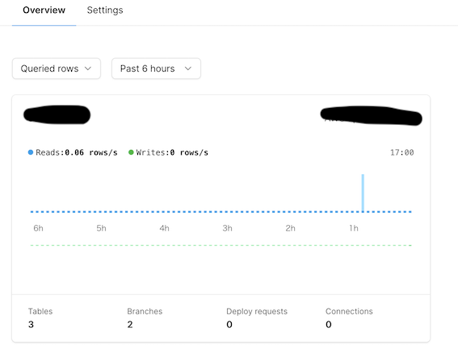
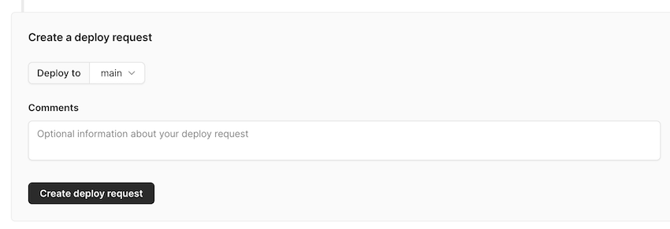
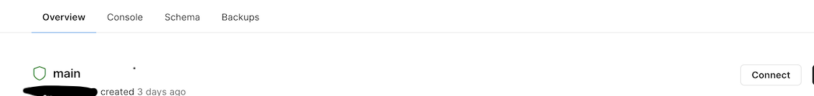
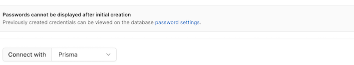

個人開発の DB には

- 低コスト
- RDB を扱える
- 簡単にデプロイできる

という点から Heroku を使っていたのだが、この前あった Heroku のデータ流出の件があってから何となく Heroku を使うのが怖くなってしまい、  
移行先候補として catnose さんが少し前に挙げていた PlanetScale を使ってみることにした

## PlanetScale とは？

- MySQL 互換のサーバーレス DB プラットフォーム
- DB のバージョンをブランチで管理できる(Deploy Request というプルリクのようなもので DB を更新していく)
- 外部キー制約をサポートしていない(内部の実装として外部キーによる制約を行わないだけで、結果として同じように制約をかけることはできる)

Nextjs × Prisma で作成するアプリに適用していく

## 手順

### 登録

[公式ページ](https://planetscale.com/)にて sign up する

```
brew install planetscale/tap/pscale
```

にて PlanetScale CLI をインストールする

```
pscale auth login
```

でログインし、

```
pscale db create <DB_NAME> --region <REGION>
```

にてデータベースを作成する。今回私はアプリを Vercel でデプロイしているので Region はそれに合わせた。
この時点で DashBoard を見るとデータベースが作成されているのが分かる。



### ブランチ作成

```
pscale branch create <DB_NAME> develop
```

で開発用ブランチを作成する。  
初めにこのブランチで テーブル を作成してそれを main ブランチにマージしていく流れとなる。(git と同じですね)

### テーブル作成

Prisma をインストールし、初期化

```
npm install prisma --save-dev
npm install @prisma/client
npx prisma init
```

作成された prisma/schema.prisma に設定、テーブル情報を追記

```
generator client {
  provider = "prisma-client-js"
  previewFeatures = ["referentialIntegrity"]
}

datasource db {
  provider = "mysql"
  url      = env("DATABASE_URL")
  referentialIntegrity = "prisma"
}

model User {
  id    String  @id @default(uuid())
  name  String
}
```

.env.local に DataBaseURL の環境変数を追記

```
DATABASE_URL = 'mysql://root@127.0.0.1:3309/<DB_NAME>'
```

開発ブランチの DB と接続する

```
pscale connect <DB_NAME> develop --port 3309
```

Schema を push することでテーブルを作成する(dotenv により.env ではなく.env.local を読み込むようにしている)

```
npx dotenv -e .env.local prisma db push
```

テーブルが作成されていることを確認(私はこの辺のコマンドは npm scripts に登録しています)

```
npx dotenv -e .env.local prisma studio
```

### デプロイ

開発ブランチにてテーブルを作成したのでデプロイしていく
まず、main ブランチを本番ブランチと設定する必要がある
作成したデータベースの DashBoard にて、main ブランチを選択する


Promote Branch ボタンをクリックし、confirm ボタンを押すことで main を本番ブランチに設定する

次に develop ブランチを選択し、Overview タブにおいて Create deploy request ボタンをクリック



Add changes to deploy queue ボタンを押すことで、デプロイが完了する

本番環境で DB に接続するには、本番にも DATABASE_URL の環境変数を登録する必要がある。
登録する URL の値は Connect ボタンをクリックし、



Connect with Prisma を選択することで確認できる



確認した値を Vercel のダッシュボードの Settings>Environment Variables から登録する
以上の流れにより、本番環境と開発環境で DB を扱うことができる。

## 最後に

開発環境と本番環境をブランチで管理できるのはとても便利だと感じた。
ちなみに無料で使えるデータベースは一組織につき一つまでです。
