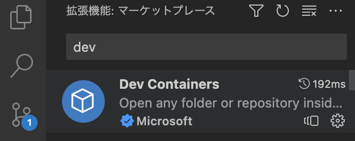
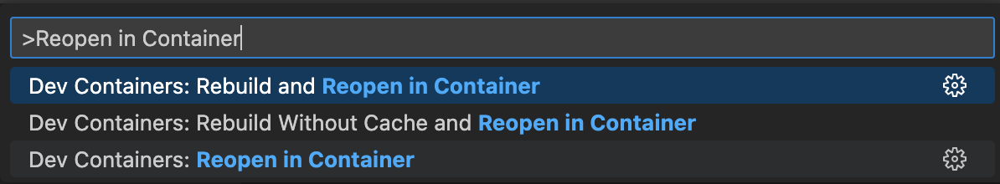
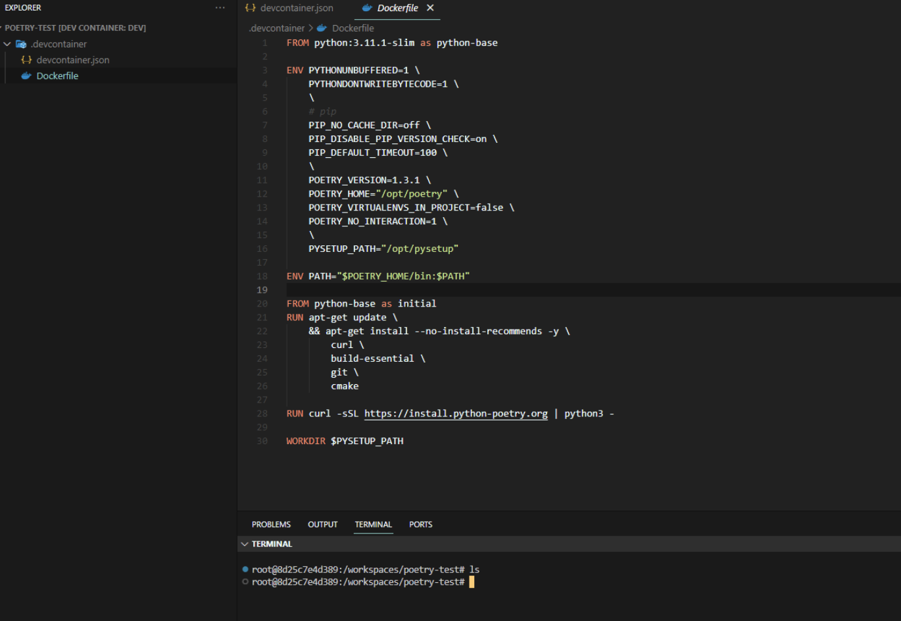

# やること

Poetry と Docker を用いてコンテナでの Python 開発環境を構築する

# Poetry とは

Python のパッケージ管理ツール。モジュールの依存関係解決、env 環境管理、パッケージングを行うことができる。

公式は[こちら](https://python-poetry.org/)

# 構築

ここからの作業は VSCode で行います

## 準備

VSCode の拡張機能 Dev Containers をインストールしておく


## Dockerfile, Dev Container 設定

### Dockerfile

Python3.11.1 の Slim イメージをベースにしています。  
Poetry とその他ライブラリをインストールするようにしています。  
また、Poetry は仮想環境を自動的に作成しますが、今回はコンテナ上で動作させるので、`POETRY_VIRTUALENVS_CREATE=false`で無効化しています。

```dockerfile:.devcontainer/Dockerfile
FROM python:3.11.1-slim as python-base

ENV PYTHONUNBUFFERED=1 \
    PYTHONDONTWRITEBYTECODE=1 \
    \
    # pip
    PIP_NO_CACHE_DIR=off \
    PIP_DISABLE_PIP_VERSION_CHECK=on \
    PIP_DEFAULT_TIMEOUT=100 \
    \
    POETRY_VERSION=1.3.1 \
    POETRY_HOME="/opt/poetry" \
    POETRY_VIRTUALENVS_CREATE=false \
    POETRY_NO_INTERACTION=1 \
    \
    PYSETUP_PATH="/opt/pysetup"

ENV PATH="$POETRY_HOME/bin:$PATH"

FROM python-base as initial
RUN apt-get update \
    && apt-get install --no-install-recommends -y \
        curl \
        build-essential \
        git \
        cmake

# Poetryインストール
RUN curl -sSL https://install.python-poetry.org | python3 -
```

### Dev Container

Dev Container の設定はこちらになります。Python の拡張機能をいれています。

```json:.devcontainer/devcontainer.json
{
  "name": "dev",
  "dockerFile": "Dockerfile",
  "extensions": [
    "ms-python.python"
  ]
}
```

## コンテナ立ち上げ

作業ディレクトリの VSCode 上でコマンドパレットから`Dev Containers: Reopen in Container`を実行し、コンテナを立ち上げます。


コンテナが立ち上がるとともに VSCode のウィンドウが切り替わり、コンテナ上で作業できるようになります。


## Python プロジェクトを作成

以下コマンドを実行し、Python プロジェクトを作成します。

```
poetry new poetry-demo
```

poetry-demo ディレクトリが作成されます。ディレクトリ構成は以下のようになっており、Poetry では`pyproject.toml`上で依存関係を管理します。

```
poetry-demo
├── pyproject.toml
├── README.md
├── poetry_demo
│   └── __init__.py
└── tests
    ├── __init__.py
    └── test_poetry_demo.py
```

poetry_demo ディレクトリ上で以下コマンドを実行し、パッケージをインストールします。試しに flask をインストールします。

```
poetry add flask
```

pyproject.toml が更新され、インストールしたパッケージが使えるようになります。

```toml:pyproject.toml
# ~~省略~~

[tool.poetry.dependencies]
python = "^3.11"
flask = "^2.2.2"

# ~~省略~~
```

Python を実行する際は poetry run <実行するコマンド>で実行します。

```
poetry run python app.py
```

以上により Poetry, Docker, VSCode による Python 開発環境の準備ができます。

# 参考記事

- [https://cocoatomo.github.io/poetry-ja](https://cocoatomo.github.io/poetry-ja)
- [https://engineers.ffri.jp/entry/2021/05/17/191143](https://engineers.ffri.jp/entry/2021/05/17/191143)
