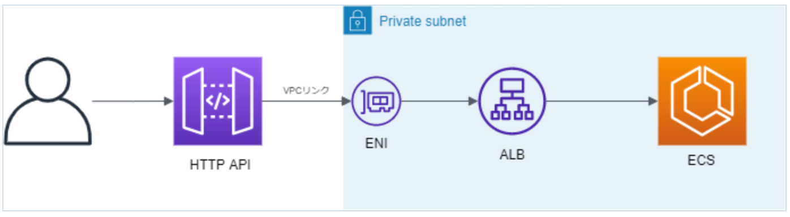

# やること

VPC リンクを通して APIGW(HTTP API)からプライベートサブネットに位置する ALB にアクセスできるようにする



# 構築

CloudFormation で構築します

## ネットワーク周り(VPC, Subnet, SG, VPC Link)

ネットワーク周りのリソースを構築します。ALB の SG には VPC Link からの接続を許可します。

```yaml
VPC:
  Type: AWS::EC2::VPC
  Properties:
    CidrBlock: 10.0.0.0/16
    EnableDnsSupport: true
    EnableDnsHostnames: true

# ALB用Subnet
PrivateSubnetALB1:
  Type: AWS::EC2::Subnet
  Properties:
    VpcId: !Ref VPC
    CidrBlock: 10.0.1.0/24
    AvailabilityZone: !Select
      - 0
      - Fn::GetAZs: !Ref AWS::Region

PrivateSubnetALB2:
  Type: AWS::EC2::Subnet
    Properties:
      VpcId: !Ref VPC
      CidrBlock: 10.0.1.0/24
      AvailabilityZone: !Select
        - 1
        - Fn::GetAZs: !Ref AWS::Region

# RouteTable
PrivateRouteTable:
  Type: AWS::EC2::RouteTable
  Properties:
    VpcId: !Ref VPC

RouteTableAssociation1:
  Type: AWS::EC2::SubnetRouteTableAssociation
  Properties:
    SubnetId: !Ref PrivateSubnetALB1
    RouteTableId: !Ref PrivateRouteTable

RouteTableAssociation1:
  Type: AWS::EC2::SubnetRouteTableAssociation
  Properties:
    SubnetId: !Ref PrivateSubnetALB2
    RouteTableId: !Ref PrivateRouteTable

VPCLink:
  Type: "AWS::ApiGatewayV2::VpcLink"
  Properties:
    Name: vpclink
    SecurityGroupIds:
    - !Ref VPCLinkSecurityGroup
    SubnetIds:
    - !Ref PrivateSubnetALBPrivate1
    - !Ref PrivateSubnetALBPrivate2

# ALB用SG
ALBSecurityGroup:
  Type: AWS::EC2::SecurityGroup
  Properties:
    GroupName: alb-sg
      GroupDescription: "alb sg"
      VpcId: !Ref VPC

# VPCリンクからの接続を許可
ALBSecurityGroupIngress:
  Type: AWS::EC2::SecurityGroupIngress
  Properties:
    IpProtocol: tcp
    FromPort : 80
    ToPort : 80
    SourceSecurityGroupId: !Ref VPCLinkSecurityGroup
    GroupId: !Ref ALBSecurityGroup
    Description: "from vpc link"

# VPC Link用SG
VPCLinkSecurityGroup:
  Type: AWS::EC2::SecurityGroup
  Properties:
    GroupName: vpclink-sg
      GroupDescription: "vpc link sg"
      VpcId: !Ref VPC

```

## ALB

先ほど設定したプライベートサブネット上に ALB を構築します。ターゲットグループ周りは省略します。

```yaml
LoadBalancer:
  Type: AWS::ElasticLoadBalancingV2::LoadBalancer
  Properties:
    Type: application
    IpAddressType: ipv4
    Name: private-alb
    Scheme: internal
    SecurityGroups:
      - !Ref ALBSecurityGroup
      Subnets:
        - !Ref PrivateSubnetALB1
        - !Ref PrivateSubnetALB2

LoadBalancerListener:
  Type: AWS::ElasticLoadBalancingV2::Listener
  Properties:
    DefaultActions:
      - Type: forward
        TargetGroupArn: !Ref TargetGroup
    LoadBalancerArn: !Ref LoadBalancer
    Port: 80
    Protocol: HTTP
```

## APIGW

HTTP API を構築します。ルート/hello へのリクエストが後段の ALB に転送されるようにします。

```yaml
APIGW:
  Type: AWS::ApiGatewayV2::Api
  Properties:
    Name: apigw-example
    ProtocolType: HTTP

APIGWStage:
  Type: AWS::ApiGatewayV2::Stage
  Properties:
    ApiId: !Ref APIGW
    StageName: dev
    AutoDeploy: true

APIIntegration:
  Type: 'AWS::ApiGatewayV2::Integration'
  Properties:
    ApiId: !Ref APIGW
    ConnectionType: VPC_LINK
    ConnectionId: !Ref VPCLink
    IntegrationType: HTTP_PROXY
    IntegrationMethod: GET
    # VPCLinkを通してALBへ転送
    IntegrationUri: !Ref LoadBalancerListener
    RequestParameters:
      overwrite:path: /hello/
    PayloadFormatVersion: 1.0

APIRoute:
  Type: AWS::ApiGatewayV2::Route
  Properties:
    ApiId: !Ref APIGW
    RouteKey: GET /hello
    # ALBを転送先とした統合を指定
    Target: !Sub 'integrations/${APIIntegration}'
```

## 少しはまったところ

APIGW を通して ALB に来るリクエストパスは、APIGW に来たリクエストパスと一致します。  
つまり、APIGW でステージ名(今回は dev)を設定している場合、APIGW に送るリクエスト url は`https://{apigwのurl}/dev/hello`となりますが、この時 ALB に来るリクエストパスは`/hello`ではなく`/dev/hello`となります。  
ALB に到達するリクエストパスを/hello としたい場合、統合の設定でリクエストパスを以下のように上書きする必要があります。

```yaml
APIIntegration:
  Type: 'AWS::ApiGatewayV2::Integration'
  Properties:
    ApiId: !Ref APIGW
    ConnectionType: VPC_LINK
    ConnectionId: !Ref VPCLink
    IntegrationType: HTTP_PROXY
    IntegrationMethod: GET
    IntegrationUri: !Ref LoadBalancerListener
    # リクエストパスを/helloに上書き
    RequestParameters:
      overwrite:path: /hello
    PayloadFormatVersion: 1.0
```

以上により、VPCLink を通して HTTP API からプライベートサブネットにある ALB へ接続できるようになります。

## 参考記事

- [https://docs.aws.amazon.com/ja_jp/apigateway/latest/developerguide/http-api-vpc-links.html](https://docs.aws.amazon.com/ja_jp/apigateway/latest/developerguide/http-api-vpc-links.html)
